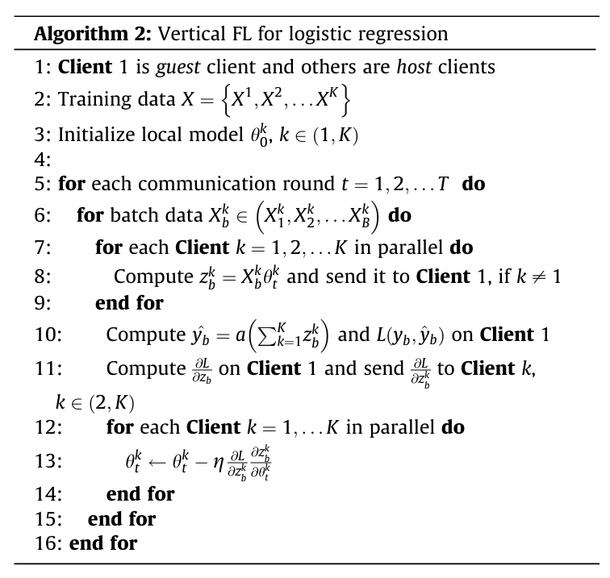

# Vertical Federated Logistic Regression
This is a simple implementation of Vertically Federated Logistic Regression applied to a heart disease prediction dataset.

A slight modification has been made to this algorithm in Line 11. Instead of allowing the guest to compute the gradients, it can only calculate the loss and share it with the hosts. The hosts compute the gradients on their end using the loss value received from the guest. From experiments, it was found that this modification in the algorithm gives better results.
[Source: Federated learning on non-IID data: A survey](https://www.sciencedirect.com/science/article/abs/pii/S0925231221013254)
